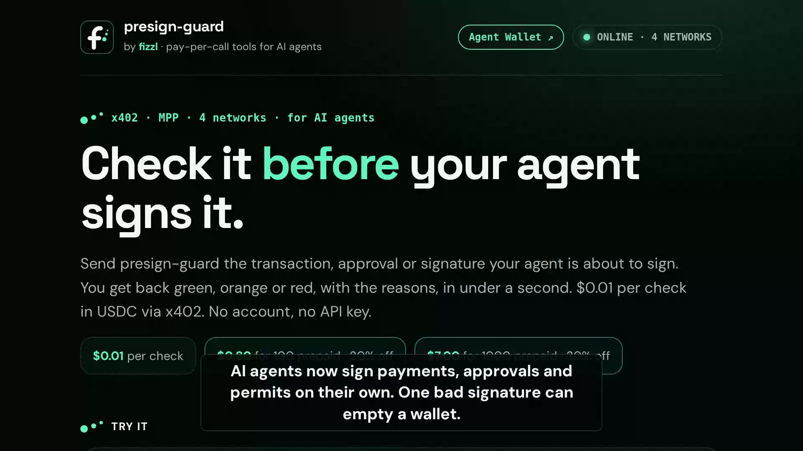
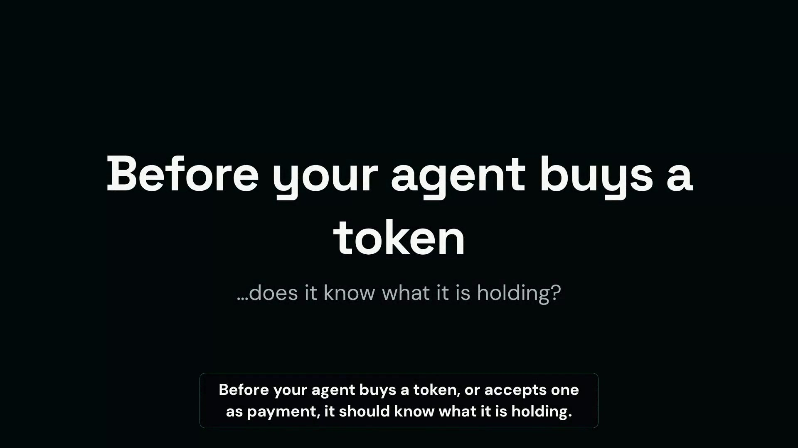

# presign-guard

A pre-sign risk check for AI agents. Before an agent signs a transaction, approval, or EIP-712 signature, it pays a few cents per call over [x402](https://x402.org) and gets back a **green / orange / red** verdict with machine-readable reason codes. Optionally, it also gets a plain-language explanation in Dutch or English.

**Watch the 1-minute explainer:** [presign-guard.onrender.com/media/explainer.mp4](https://presign-guard.onrender.com/media/explainer.mp4)

[](https://presign-guard.onrender.com/media/explainer.mp4)

**New: the token verdict in 45 seconds:** [presign-guard.onrender.com/media/token.mp4](https://presign-guard.onrender.com/media/token.mp4)

Part of [Klaartaal](https://github.com/Fizzl13/SmartContractExplainer) by [FIZZL AI](https://fizzl.eu).

## Endpoints

| Route | Price | Returns |
|---|---|---|
| `POST /v1/check` | $0.01 USDC | Verdict, reason codes, decoded subject |
| `POST /v1/check/explain` | $0.03 USDC | The same, plus a plain-language explanation (`lang: "nl"` or `"en"`) |
| `GET /v1/token?chain=…&address=…` | $0.01 USDC, Base or Solana | Token verdict: grade, reason codes, one-line summary, market data (see below) |
| `GET /v1/approvals?chain=…&address=…` | $0.02 USDC, Base or Solana | Wallet approval audit: every open token approval, its spender, and which to revoke (see below) |
| `POST /mcp` | free / paid | MCP server (Streamable HTTP): see below |
| `GET /health` | free | Liveness |
| `GET /openapi.json` | free | OpenAPI 3.1 spec with prices (`x-payment-info`) |
| `GET /.well-known/x402` | free | x402 discovery manifest |

Payment is x402 v2 with the `exact` scheme, in USDC on Base (the token verdict and the approval audit also on Solana). The 402 carries Bazaar discovery metadata (input example, input and output schema), and the challenge is mirrored into the JSON body for clients that don't read the `PAYMENT-REQUIRED` header. **You are never charged for an error.** Invalid requests (400) and upstream outages (503) cancel settlement, and they always return `verdict: null`, never a guessed verdict.

## MCP

`https://presign-guard.onrender.com/mcp` is an MCP server (Streamable HTTP, stateless) for Claude, Cursor and agent frameworks, listed in the official MCP registry as `io.github.Fizzl13/presign-guard`.

| Tool | Price | Returns |
|---|---|---|
| `presign_quick_check` | free, 10 calls/hour | The verdict only (green, orange or red) |
| `presign_check` | $0.01 USDC via x402 | The full verdict and reason codes, as `POST /v1/check` |
| `presign_check_explain` | $0.03 USDC via x402 | The same plus a plain-language explanation, as `POST /v1/check/explain` |
| `token_quick_verdict` | free, shares the 10 calls/hour | The token verdict and grade only |
| `token_verdict` | $0.01 USDC via x402 | The full token verdict, as `GET /v1/token` |
| `wallet_approvals` | $0.02 USDC via x402 | The wallet approval audit, as `GET /v1/approvals` |

The paid tools are paid inside the MCP call with the x402 MCP transport (`_meta["x402/payment"]`), on Base (`token_verdict` and `wallet_approvals` also on Solana), to the same payout wallets as the HTTP routes. Invalid input is refused before payment, and a failed check is not charged.

## Token verdict

[](https://presign-guard.onrender.com/media/token.mp4)

`GET /v1/token?chain=solana&address=<mint>` (or `chain=base|ethereum|arbitrum|optimism|polygon|bsc` with a `0x` token contract) answers one question before an agent buys, holds or accepts a token: is the token itself a trap?

```json
{
  "verdict": "orange",
  "grade": "RISKY",
  "one_liner": "RISKY: 1% transfer fee; $21k liquidity; 1 h old (+2 more)",
  "reasons": [{ "code": "TRANSFER_FEE", "severity": "orange", "details": { "feePct": 1 } }, "…"],
  "token": { "chain": "solana", "address": "…", "name": "…", "symbol": "…" },
  "market": { "priceUsd": 0.0004, "liquidityUsd": 21000, "marketCapUsd": 400000, "volume24hUsd": 90000, "firstPairAt": "…", "ageSeconds": 3600, "url": "https://dexscreener.com/…" },
  "sources": ["goplus", "dexscreener", "rugcheck"],
  "checkedAt": "…"
}
```

Grades: `SAFE` (green), `CAUTION` (one orange reason), `RISKY` (two or more), `AVOID` (red). The one-liner states facts only.

| Severity | Codes |
|---|---|
| red | `RUGGED`, `NON_TRANSFERABLE`, `MALICIOUS_AUTHORITY`; EVM: `TOKEN_HONEYPOT`, `TOKEN_AIRDROP_SCAM`, `TOKEN_IMPERSONATION` |
| orange | `MINT_AUTHORITY_ACTIVE`, `FREEZE_AUTHORITY_ACTIVE`, `BALANCE_MUTABLE`, `CLOSABLE`, `TRANSFER_HOOK`, `TRANSFER_FEE`, `HIGH_TRANSFER_FEE` (≥10%), `TRANSFER_FEE_UPGRADABLE`, `LP_NOT_LOCKED` (<50% locked, token younger than 30 days), `LOW_LIQUIDITY` (<$50k), `NO_DEX_MARKET`, `NEW_TOKEN` (<24 h), `TOP_HOLDERS_CONCENTRATED` (top holder >20% or top 10 >50%, pools and locked accounts excluded; on EVM only wallets count, not contracts); EVM: the GoPlus token codes of `/v1/check` (`TOKEN_HIGH_TAX`, `TOKEN_UNVERIFIED`, …) and `TOKEN_CANNOT_BUY` |
| info | `MUTABLE_METADATA`, `NO_SOCIALS`, `TOKEN_ON_TRUST_LIST`, `NO_SECURITY_DATA`, `RUGCHECK_DANGER`, `RUGCHECK_UNAVAILABLE`, `LP_NOT_LOCKED` on older tokens, on trust-list tokens (USDC, USDT, WETH): the issuer's powers, `LP_NOT_LOCKED`, `LOW_LIQUIDITY` and `NO_DEX_MARKET` (DexScreener undercounts quote assets) |

On a token on the GoPlus trust list (USDC, USDT), the issuer's powers (mint, freeze, change balances) are info: the issuer keeps them on purpose. Missing data never makes a token red. If GoPlus or DexScreener is down there is no verdict (503, not charged); if RugCheck is down the verdict comes without it and says so.

## Wallet approval audit

`GET /v1/approvals?chain=base&address=<wallet>` (or `chain=ethereum|arbitrum|optimism|polygon|bsc`) is the follow-up to `/v1/check`: that one asks "should I sign this approval?", this one asks "which approvals did I already give, and which should I revoke?". Agents with their own wallet can run it as a periodic check.

```json
{
  "verdict": "red",
  "grade": "AVOID",
  "one_liner": "AVOID: 5 approvals, 1 to a flagged address, 1 to a plain wallet, 1 unlimited; revoke 3",
  "reasons": [{ "code": "SPENDER_MALICIOUS", "severity": "red", "details": { "count": 1, "spenders": ["0x…"] } }, "…"],
  "summary": { "approvals": 5, "tokens": 2, "unlimited": 2, "toRevoke": 3 },
  "approvals": [{
    "token": { "address": "0x…", "symbol": "USDC" },
    "spender": { "address": "0x…", "name": null, "trusted": false, "contract": true },
    "amount": "500", "unlimited": false, "approvedAt": "…", "severity": "red",
    "codes": [{ "code": "SPENDER_MALICIOUS", "severity": "red", "details": { "behaviors": ["phishing_activities"] } }],
    "revoke": true
  }, "…"],
  "revokeUrl": "https://revoke.cash/address/0x…?chainId=8453"
}
```

| Severity | Codes (per approval; the wallet-level reasons count them) |
|---|---|
| red | `SPENDER_MALICIOUS` (the spender is flagged by GoPlus) |
| orange | `APPROVAL_TO_WALLET` (the spender is a plain wallet, not a contract), `SPENDER_SUSPICIOUS` (GoPlus doubt list), `SPENDER_UNVERIFIED` (contract source not verified), `UNLIMITED_APPROVAL` (to a spender not on the GoPlus trust list) |
| info | `UNLIMITED_APPROVAL_TRUSTED` (e.g. Permit2), `STALE_APPROVAL` (older than a year), `TOKEN_FLAGGED` (the approved token itself), `NO_APPROVALS` |

Every approval with an orange or red code has `revoke: true`. The grades are the same as the token verdict. Source: GoPlus `token_approval_security` (ERC-20 allowances); NFT approvals are not covered. If GoPlus is down there is no verdict (503, not charged).

## Request types

```jsonc
// Token approval
{ "type": "approval", "chainId": 8453, "token": "0x…", "spender": "0x…", "amount": "1000000" }

// Raw transaction (approve / increaseAllowance / setApprovalForAll are decoded)
{ "type": "transaction", "chainId": 8453, "to": "0x…", "data": "0x…", "value": "0" }

// EIP-712 signature: pass the eth_signTypedData_v4 payload as an object or JSON string
{ "type": "signature", "chainId": 8453, "typedData": { "domain": {…}, "types": {…}, "primaryType": "PermitSingle", "message": {…} } }
```

Supported chains: 1, 10, 56, 137, 8453, 42161.

Optional on every type: `"origin": "https://…"`, the site asking for the signature or transaction (a URL or a hostname). Its domain age is looked up: a domain registered less than 30 days ago is orange (`NEW_DOMAIN`), which catches the fresh phishing sites wallet drainers run on. It is also checked against phishing lists and lookalikes: on MetaMask's eth-phishing-detect blocklist (via PG1) or GoPlus's phishing list is red (`PHISHING_SITE`, `details.flaggedBy` names the lists); a lookalike of a known brand (PG1's typosquat detection, e.g. `metamask-login.com` → `metamask.io`) is orange (`LOOKALIKE_SITE`); with `METAMASK_SCAN=on` (off by default: MetaMask's site-scanner endpoint has no published API or licence), a site MetaMask's own site scanner (Blockaid) blocks is orange (`WALLET_BLOCKS_SITE`), not red, because that scanner also blocks legitimate browser-payment pages. A source that can't be reached is `SITE_REPUTATION_UNAVAILABLE` (info), never a clean result. `ORIGIN_REPUTATION=off` turns these checks off. Local and IP origins are not looked up.

Recognised signatures: EIP-2612 `Permit`, DAI-style permit, Permit2 (`PermitSingle`, `PermitBatch`, `PermitTransferFrom`, batch and witness variants), EIP-3009 `TransferWithAuthorization` / `ReceiveWithAuthorization` (what x402 asks an agent to sign to pay), and Seaport `OrderComponents`.

An x402 payment moves one fixed amount to one recipient and grants no allowance, so paying a plain wallet is green (`PAYMENT_AUTHORIZATION`, info). It turns red if the recipient is flagged, and orange if the amount is effectively unlimited or the authorization stays valid for more than a month. Anything else comes back at least orange (`UNRECOGNIZED_SIGNATURE`).

## Response

```json
{
  "version": "2",
  "verdict": "red",
  "reasons": [
    { "code": "UNLIMITED_APPROVAL", "severity": "orange", "subject": "0x…", "details": { "token": "0x…" } },
    { "code": "SIGNATURE_GRANT_TO_EOA", "severity": "red", "subject": "0x…" }
  ],
  "subject": { "chainId": 8453, "kind": "permit2_allowance", "offchain": true, "grants": [ … ] },
  "scope": "…",
  "sources": ["goplus"],
  "checkedAt": "2026-09-23T12:00:00.000Z"
}
```

Every token that is approved, permitted or paid is also checked with GoPlus token security (honeypot, impersonation, owner powers, taxes). The verdict is the most severe reason: any `red` makes it red, otherwise any `orange` makes it orange. `info` reasons never change the verdict.

### Reason codes

| Severity | Codes |
|---|---|
| red | `PHISHING_SITE` (the origin is on a phishing list; `details.flaggedBy`), `PHISHING_ACTIVITIES`, `STEALING_ATTACK`, `SANCTIONED` and other GoPlus address flags, `MALICIOUS_DELEGATE` (an EIP-7702 wallet delegates to a flagged contract; details name the delegate and the flags), `SANCTIONED_ADDRESS` (on the OFAC SDN list; details name the SDN entry and program, and `alsoFlaggedBy: ["goplus"]` replaces GoPlus's own `SANCTIONED` for the same address), `CREATOR_OF_MALICIOUS_CONTRACTS`, `MALICIOUS_CONTRACT_BEHAVIOR`, `ON_DOUBT_LIST`, `UNLIMITED_APPROVAL_TO_EOA`, `SIGNATURE_GRANT_TO_EOA`, `ORDER_PAYS_YOU_NOTHING`, and for the token itself `TOKEN_HONEYPOT`, `TOKEN_IMPERSONATION` (details name the real token), `TOKEN_AIRDROP_SCAM` |
| orange | `LOOKALIKE_SITE` (origin imitates a known brand), `WALLET_BLOCKS_SITE` (MetaMask's site scanner blocks the origin), `UNVERIFIED_DELEGATE` (an EIP-7702 wallet delegates to unverified code), `UNLIMITED_APPROVAL`, `UNLIMITED_TRANSFER`, `APPROVAL_FOR_ALL`, `APPROVAL_TO_EOA`, `SIGNATURE_TRANSFER`, `LONG_LIVED_PERMISSION`, `NONCANONICAL_PERMIT2`, `UNVERIFIED_CONTRACT`, `RECENTLY_DEPLOYED`, `MARKETPLACE_ORDER`, `UNRECOGNIZED_SIGNATURE`, `BLACKLIST_DOUBT`, `MIXER`, `NEW_DOMAIN` (origin registered under 30 days ago), `DOMAIN_NOT_REGISTERED`, and for the token `TOKEN_OWNER_CAN_CHANGE_BALANCES`, `TOKEN_OWNERSHIP_RECLAIMABLE`, `TOKEN_HIDDEN_OWNER`, `TOKEN_SELFDESTRUCT`, `TOKEN_CANNOT_SELL_ALL`, `TOKEN_CREATOR_MADE_HONEYPOTS`, `TOKEN_HIGH_TAX` (buy or sell tax of 10% or more), `TOKEN_UNVERIFIED` |
| info | `EIP7702_DELEGATED_WALLET` (a plain wallet with EIP-7702 code, treated as a wallet; details name the delegate contract, which is screened like a spender), `PARTIAL_SOURCE_DATA` (GoPlus returned partial data for this address), `PAYMENT_AUTHORIZATION`, `REVOKES_APPROVAL`, `OFFCHAIN_SIGNATURE`, `SIGNATURE_EXPIRED`, `UPGRADEABLE_PROXY` (only when the chain confirms a standard proxy layout: EIP-1967 or its beacon, EIP-1822, the older OpenZeppelin slot or an EIP-1167 clone; details name the kind and what it points to, or `confirmed: false` when the chain RPC can't be asked), `ON_TRUST_LIST`, `UNDECODED_CALL`, and issuer controls on the token (USDC has several): `TOKEN_MINTABLE`, `TOKEN_PAUSABLE`, `TOKEN_BLACKLIST`, `TOKEN_UPGRADEABLE`, `TOKEN_TAX_MODIFIABLE`, `TOKEN_TRADING_COOLDOWN`, `TOKEN_TAX`, `TOKEN_ON_TRUST_LIST`, `TOKEN_NO_SECURITY_DATA` (GoPlus has no record of the token), `DOMAIN_AGE`, `DOMAIN_AGE_UNKNOWN` (no RDAP data for that TLD), `SITE_ALLOWLISTED` (origin on MetaMask's allowlist), `SITE_REPUTATION_UNAVAILABLE` (a phishing-list source could not be reached; `details.sources`), and when PG1 can't be reached `SANCTIONS_SCREEN_UNAVAILABLE` / `DOMAIN_AGE_UNAVAILABLE` (the check goes on; GoPlus still carries a sanctions flag) |

### Signed verdicts

Every paid answer (HTTP and MCP) carries a `receipt` signed by presign-guard, so you can later prove **which verdict was delivered for which request**, not only that you paid:

```json
"receipt": {
  "request_id": "5f0c…",
  "route": "POST /v1/check",
  "input_sha256": "9a1e…",
  "payment": { "network": "eip155:8453", "asset": "0x8335…", "amount": "10000", "pay_to": "0x6B0F…", "payer": "0x0fD3…", "nonce": "0x5c1d…", "proof": "eip3009" },
  "signed_at": "2026-09-27T09:30:00.000Z",
  "signer": "0x…",
  "algorithm": "eip191-canonical-json-v1",
  "signature": "0x…"
}
```

- **What is signed:** the whole response with `receipt.signature` left out, as canonical JSON (keys sorted at every level, no whitespace, non-ASCII as `\uXXXX`: the same bytes as Python's `json.dumps(obj, sort_keys=True, separators=(",", ":"), ensure_ascii=True)`), with EIP-191 `personal_sign`. Flipping the verdict, or moving it to another request id, breaks the signature.
- **`input_sha256`** is the SHA-256 of the canonical JSON of `{"route": …, "input": …}`, where `input` is your JSON body (POST), your query parameters as strings (GET), or the tool arguments (MCP, route `mcp <tool>`). Recompute it to prove the verdict answers *your* request.
- **`payment`** ties the verdict to the payment that bought it, from your x402 payment payload. On Base: the payer and the EIP-3009 nonce, so anyone can find the settlement on-chain as the USDC contract's `AuthorizationUsed(payer, nonce)` event without trusting us. On Solana: the payer and a SHA-256 of the signed transaction you sent (the facilitator adds its fee-payer signature at settlement, so the final transaction id is not known when we sign).
- **Signer addresses:** [`/.well-known/presign-guard-signer.json`](https://presign-guard.onrender.com/.well-known/presign-guard-signer.json). Retired signers stay listed with their dates, so old receipts keep verifying.
- **Check one for free:** `POST /v1/verify` with `{"response": <the signed answer>, "route": "POST /v1/check", "input": <what you sent>}` returns `valid`, `signer`, `known_signer` and `input_matches`.

Verify it yourself (Node, viem):

```js
import { recoverMessageAddress } from "viem";
const { signature, ...rest } = answer.receipt;
const signer = await recoverMessageAddress({ message: canonicalJson({ ...answer, receipt: rest }), signature });
// signer must equal answer.receipt.signer and be listed in /.well-known/presign-guard-signer.json
```

Python (eth-account):

```python
import json
from eth_account import Account
from eth_account.messages import encode_defunct
receipt = dict(answer["receipt"]); sig = receipt.pop("signature")
msg = json.dumps({**answer, "receipt": receipt}, sort_keys=True, separators=(",", ":"), ensure_ascii=True)
assert Account.recover_message(encode_defunct(text=msg), signature=sig) == answer["receipt"]["signer"]
```

**Key rotation without client updates:** the payout wallet (`0x6B0F4651eD42893ab58139938175E4a69f175F25`, the `payTo` of every payment) authorises each signing key with a certificate: a `personal_sign` over

```
fizzl receipt signer
service: presign-guard
signer: <signing key address>
valid_from: <YYYY-MM-DD>
```

Set it as `RECEIPT_SIGNER_CERT` (`YYYY-MM-DD:0x<signature>`; the page `/sign-receipt-key` produces it from the wallet's browser; `/sign-receipt-key?service=x402-doctor` does the same for x402 Doctor, so the payout wallet signs on one site only). It is checked at startup and carried inside every receipt as `receipt.cert`, so a client that pins only the payout wallet verifies receipts from a new key offline. To rotate: generate a new `RECEIPT_SIGNER_SECRET`, sign a new certificate, move the old address to `RECEIPT_RETIRED_SIGNERS`.

The signing key comes from `RECEIPT_SIGNER_SECRET` (any long random string; it holds no funds and signs nothing but receipts). Without it, answers are unsigned.

### Not covered

`eth_sign` and `personal_sign` messages, and transaction simulation. Treat a green verdict as "no known risk signals", not as a guarantee.

## Run locally

```bash
cp .env.example .env   # fill in PAY_TO and ANTHROPIC_API_KEY
npm install
npm test               # 36 tests, network mocked
npm run dev
```

## End-to-end payment test (Base Sepolia)

Fund a **throwaway** wallet with Base Sepolia test USDC, set `AGENT_PRIVATE_KEY` and `CHECK_URL` in `.env`, then run:

```bash
npm run client
```

The script makes a valid call, which should return 200 with a settlement receipt, and an invalid call, which should return 400 with no charge.

## Deploy to Render

The live service runs on Base mainnet: `render.yaml` sets `X402_NETWORK=eip155:8453`, which needs `CDP_API_KEY_ID` and `CDP_API_KEY_SECRET` (Coinbase CDP facilitator; the service refuses to start on mainnet without them). After the first paid call settles through CDP, the routes are listed in the CDP Bazaar. To test without real money, set `X402_NETWORK=eip155:84532` (Base Sepolia, public x402.org facilitator); without `X402_NETWORK` the code also defaults to Base Sepolia.

`PAY_TO_SOLANA` (optional) is a Solana address for USDC payments on Solana, offered for the token verdict only; those payments settle through the PayAI facilitator (`SOLANA_FACILITATOR_URL` to override). Without it, the token verdict is paid on Base only.

`PAY_TO` must be an EVM address (`0x` + 40 hex characters). Surrounding spaces are trimmed; anything else stops the server at startup with a clear error, so a typo can't publish an unpayable 402.

## Data sources

Risk data comes from the [GoPlus Security API](https://gopluslabs.io). OFAC SDN sanctions screening and domain age come from [PG1](https://pg1-ai-agent.vercel.app) (public OFAC and RDAP data, credited as `pg1` in `sources`; set `PG1_API_KEY` to a PG1 membership key to be exempt from PG1's anonymous rate limit); the token verdict adds [RugCheck](https://rugcheck.xyz) (Solana) and [DexScreener](https://dexscreener.com) (market data). Plus `eth_getCode` on a public RPC to recognise EIP-7702 wallets (override with `RPC_URL_<chainId>`). Explanations come from Claude (Anthropic).
